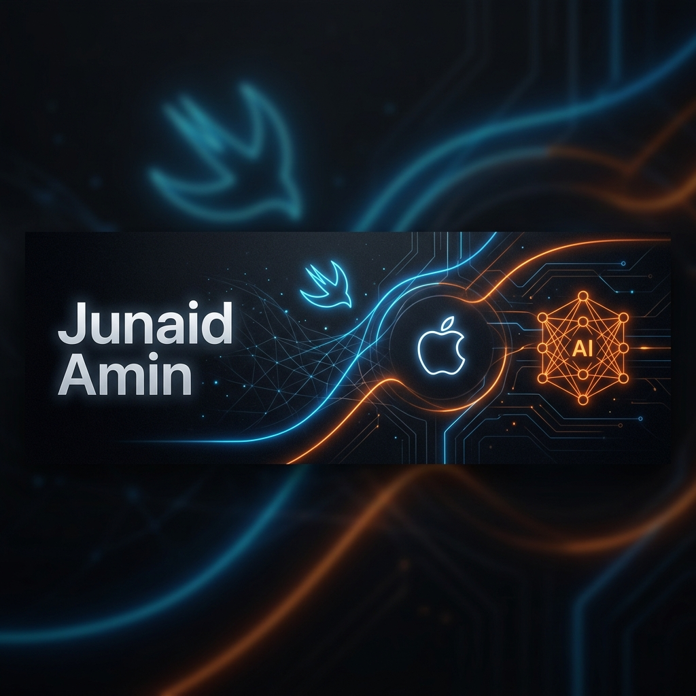

# 👋 Hi there, I'm Junaid Amin!

  

  

---

### 👨‍💻 About Me

I am a **Software Engineering Student** and a dedicated **Freelance iOS Developer**. My expertise lies in building high-performance, user-centric mobile applications on **macOS** and **iOS** using **Swift** and **SwiftUI**. I am also proficient in leveraging advanced AI systems to streamline development and architect scalable solutions.

- 🍎 **Premium iOS/Mac Stack (Expert)**: Specialized in architecting top-tier mobile & desktop apps.
- 📱 **Android Ecosystem (Basic)**: Proficient in fundamental Android development.
- 🤖 **AI-First Workflow**: Expertly integrating agentic AI IDEs into the production cycle.
- 🎨 **Design Philosophy**: Focused on premium, high-end aesthetics and seamless UX.

---

### 🛠️ Tech Stack & Advanced Tools

#### 🍎 Premium Mobile (Expert)

  
  
  

#### 🤖 AI-Powered IDEs & Agents

  
  
  
  
  
  
  

#### 💻 Traditional IDEs & Development Tools

  
   
  
  

#### 📱 Android Development (Basic)

  

---

### 📊 GitHub Stats

  
  

  

---

### 🔗 Connect with Me

---

<i>"Turning coffee into code, one app at a time."</i> ☕📱

