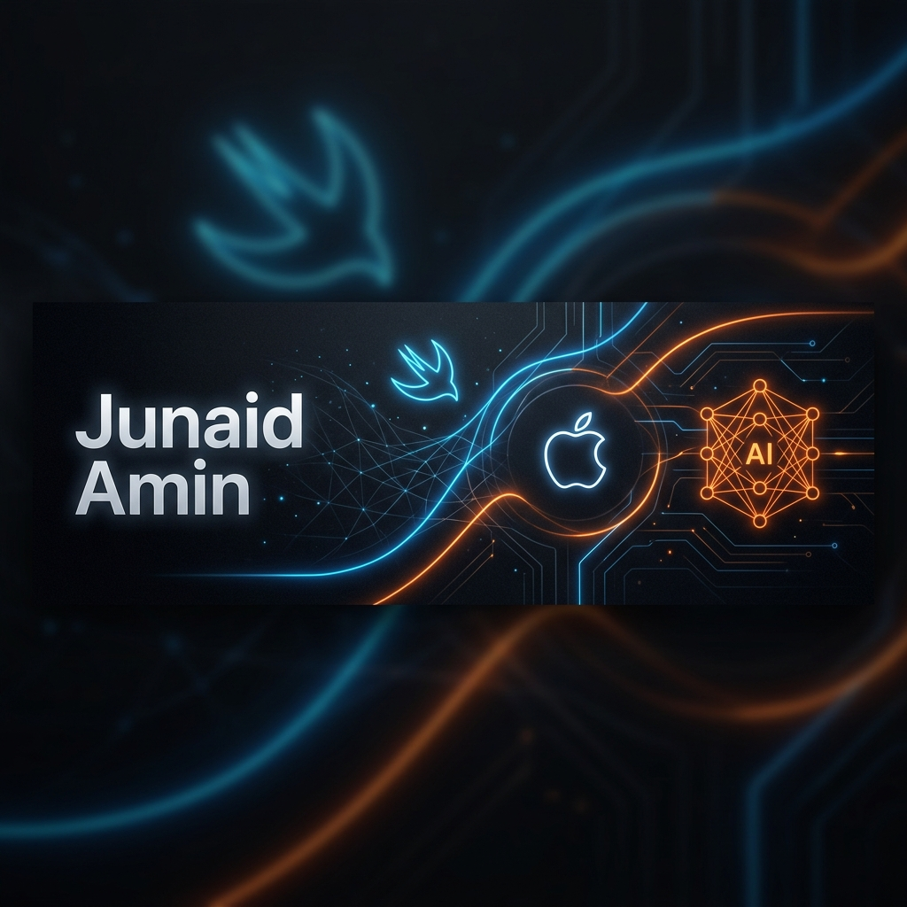

  

  

---

### 👨‍💻 About Me

I am a **Software Engineering Student** and a dedicated **iOS Developer** specializing in native **Swift & SwiftUI** development. While my primary domain and expertise lie in the iOS ecosystem, I also possess strong hands-on experience and capability in building cross-platform mobile applications using **Flutter & Dart**, alongside integrating robust backend services with **Firebase**, **Stripe payment systems**, and **AI Models**.

- 🍎 **Native iOS Specialist (Primary Focus)**: Specialized in architecting high-performance mobile & desktop apps using **Swift** & **SwiftUI**.
- 💙 **Flutter & Cross-Platform**: Skilled in building smooth, production-ready cross-platform apps with **Flutter & Dart**.
- 🔥 **Firebase Suite**: Hands-on experience with Firestore, Authentication, Cloud Storage, and Realtime backend solutions.
- 💳 **Payments & Integrations**: Implementing secure **Stripe** payment gateways, escrow flows, and RESTful APIs.
- 🤖 **AI & LLM Integration**: Incorporating **OpenAI**, **Google Gemini**, and **Claude** AI models into modern applications.

---

### 🛠️ Tech Stack & Ecosystem

#### 🍎 Mobile & Cross-Platform

  
  
  
  
  
  

#### 🔥 Cloud, Payments & Backend Services

  
  
  
  
  

#### 🧠 AI Models & API Integrations

  
  
  

#### 🤖 AI-Powered Agents & Dev Tools

  
  
  
  
  
  

#### 🛠️ General Technologies

  

---

### 📊 GitHub Analytics & Stats

  
  

  

---

### 🔗 Connect with Me

---

<i>"Turning coffee into code, one app at a time."</i> ☕📱

